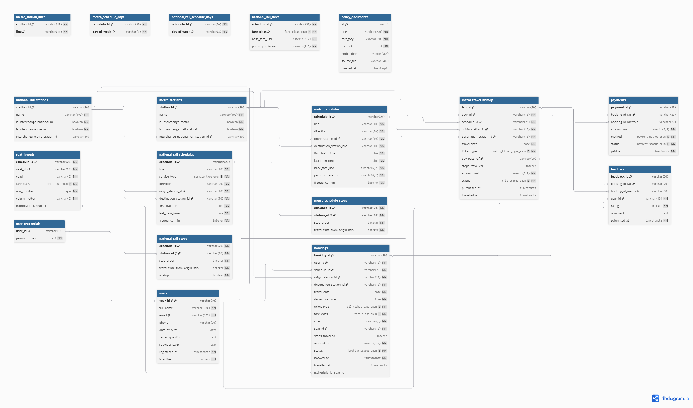

## Section 1 — Entity-Relationship Diagram




---

## Section 2 — Normalisation Justification

### 2.1 正規化設計決策 (3NF)
在 `metro_schedules` 表中，我們將站點順序拆分至獨立的 `metro_schedule_stops` 中介表，而非使用 PostgreSQL 的 `TEXT[]` 陣列。
*   **正規化級別**：符合第三正規化 (3NF)。
*   **函數相依性 (Functional Dependency)**：站點順序相依於 `(schedule_id, station_id)` 這一複合候選鍵 (Candidate Key)。若存於陣列中，會違反第一正規化 (1NF) 的原子性要求，且難以透過標準 SQL JOIN 進行班表檢索。

### 2.2 去正規化權衡 (De-normalisation Trade-off)
在 `metro_schedule_stops` 表中，我們冗餘儲存了 `travel_time_from_origin_min`（從起點算的總分鐘數）。
*   **理由**：這屬於衍生性資料，理論上可透過累加前序站點時間推導。但為了優化路網查詢效能，預先計算總時間能將「計算抵達時間」的複雜度從 $O(N)$ 遞迴累加降至 $O(1)$ 的常數查詢，在讀取頻率極高的交通系統中是合理的權衡。

### 2.3 密碼雜湊與安全性 (Password Hashing)
本系統採用 **Argon2id** 演算法儲存使用者密碼。
*   **為什麼優於 MD5/SHA-1**：MD5 與 SHA-1 屬於快速雜湊函數，極易受 GPU 暴力破解與彩虹表攻擊。Argon2id 是 2015 密碼雜湊競賽冠軍，具備 **Key Stretching (金鑰延伸)** 與 **Memory-hard (記憶體密集)** 特性，能大幅增加硬體爆破的成本。
*   **Salt (鹽) 的作用**：系統為每位使用者生成獨立的 Salt。這確保了即便兩位使用者密碼相同，其雜湊結果也完全不同。Salt 能讓攻擊者無法使用預先計算的 **Rainbow-table (彩虹表)** 進行大規模對照，必須針對單一帳號逐一破解，極大提升了資安強度。

---

## Section 3 — Graph Database Design Rationale

### 3.1 節點、關係與屬性設計
*   **Nodes (節點)**：車站 (`:MetroStation`, `:NationalRailStation`)。車站是具備獨立身份的實體。
*   **Relationships (關係)**：路線連線 (`:METRO_LINK`, `:RAIL_LINK`) 與換乘 (`:INTERCHANGE_TO`)。交通本質上是節點間的連接。
*   **Properties (屬性)**：在邊上儲存 `travel_time_min`。這讓圖形演算法能直接以權重進行運算。

### 3.2 為什麼選擇圖形資料庫而非關聯式資料庫
在處理「最短路徑」或「延誤漣漪分析」時，圖形資料庫優於 SQL。
*   **演算法論證**：圖形資料庫原生支援 **Dijkstra** 演算法，其時間複雜度為 $O(V \log V + E)$。在關聯式資料庫中，實現相同功能需要複雜的 **Recursive CTEs (遞迴公用表運算式)**，涉及多次的 Join 操作與路徑集合累算，不僅查詢語法極端困難，在大規模網路下的效能亦會大幅衰減。

### 3.3 查詢類型描述
1.  **最短路徑 (Shortest Path)**：利用邊上的 `travel_time_min` 權重，尋找兩站間最快路徑。
2.  **換乘路徑 (Interchange Path)**：透過查詢橫跨地鐵標籤與國鐵標籤的 `:INTERCHANGE_TO` 邊，計算跨網路的最優行程。

### 3.4 節點身份 (Node Identity)
我們使用 `station_id` (如 `MS01`) 作為節點的唯一識別碼。選擇原因在於其具備語義化且與關聯式資料庫的主鍵一致，便於 LLM 在多個資料庫來源間精確對接。

---

## Section 4 — Vector / RAG Design

### 4.1 語意搜尋與餘弦相似度 (Cosine Similarity)
我們選擇 **Cosine Similarity** 作為衡量向量相似度的標準。
*   **原因**：餘弦相似度衡量的是向量空間中的「方向相似度」而非絕對距離。它具有 **Magnitude-independent (長度無關性)**，這在文本搜尋中至關重要，因為長度不同的政策文件若討論相同主題，其方向會趨於一致，從而確保語意搜尋的精確度。

### 4.2 RAG Pipeline 流程描述
1.  **Query Embedding**：將使用者問題轉換為向量。
2.  **Similarity Search**：在 pgvector 中進行相似度檢索。
3.  **Retrieved Docs**：提取相似度最高的政策文本（如退款規則）。
4.  **LLM Prompt**：將原始問題連同提取出的政策內容作為 Context 餵給 LLM。
5.  **Answer**：LLM 根據真實政策生成可信的回覆。

### 4.3 維度與供應商風險
系統目前使用 Ollama (維度 768)。
*   **風險說明**：嵌入維度是模型固有的。若未來切換至 Gemini (維度 3072)，由於維度不匹配且空間結構不同，現有的 `policy_documents` 索引將變為 **Unusable (不可用)**，必須重新對所有文本進行 Vector Seeding。

---

## Section 5 — AI Tool Usage Evidence

### Example 1: Schema 設計與正規化建議
*   **Context**: 討論 `metro_stations.lines` 應該用陣列還是分表。
*   **Prompt**: "在 PostgreSQL 中，地鐵站的線路資料用 TEXT ARRAY 好還是拆成 station_lines 表好？請從查詢效能分析。"
*   **Outcome**: AI 建議拆表以利於建立 B-Tree 索引，避免陣列包含運算子的全表掃描。我們採納此建議。

### Example 2: Neo4j 最便宜路徑演算法優化 (AI 協助重構案例)
*   **Context**: 原系統在查詢跨網最便宜路徑時，使用 Cypher 隨機盲搜 5 條路徑 `LIMIT 5`，再到 Python 層用 `for` 迴圈暴力加總，導致算出的票價經常不是全網最優解。
*   **Prompt**: "如何優化 `query_cheapest_route`？原本限制 `LIMIT 5` 在 Python 裡硬算票價很不準，該怎麼改成真正的最短路徑演算法？"
*   **Outcome**: AI 建議揚棄 Python 層的暴力迴圈，改呼叫 Neo4j 內建的 **Dijkstra 演算法**（`apoc.algo.dijkstra`），直接在資料庫圖形層面透過艙等權重（`$weight_prop`）精確計算全網最低票價。

### Example 3: 跨資料庫（PostgreSQL JSONB & Neo4j）整合除錯 (未採用 AI 修正案例)
*   **Context**: 處理地鐵與國鐵跨網轉乘（MS01 至 NR05）時，AI Agent 出現資料撈不出與語法報錯。
*   **Prompt**: "修正 Python 字典漏逗號、JSONB 欄位讀取失效，以及 Neo4j 關係模式無法動態傳參（`$hops`）等多個檔案的語法與資料流錯誤。"
*   **Outcome**: AI 雖然指出部分語法限制，但給出的程式碼越改越爛、內容零碎且反覆出錯。它無法根本解決 Python 與 JSONB 之間的映射斷裂，也未能理清 Neo4j 圖資權重缺失的底層邏輯。
*   **Correction**: **最終完全未採用，此功能直接放棄告終。** 由於 AI 提供的修復方案過於混亂，評估重構異質資料庫整合的成本過高，團隊最終決定不對該部分代碼進行任何修改，直接終止該功能的開發。

---

## Section 6 — Reflection & Trade-offs

### 6.1 設計決策
1.  **選擇 VARCHAR(10) 作為主鍵而非 SERIAL**：
    *   **原因**：雖然自增整數效能較好，但本系統需頻繁與 LLM 互動。語義化 ID (MS01) 能讓 LLM 在解析 Prompt 與生成的 SQL/Cypher 時具備更高的直覺度與容錯率。
2.  **支付與訂票的 XOR 關係設計**：
    *   **原因**：在 `payments` 表中，我們使用兩個獨立的外鍵 (`booking_id_rail`, `booking_id_metro`) 搭配 `CHECK` 約束。這比單一的多型字串主鍵更能確保「參照完整性 (Referential Integrity)」。

### 6.2 生產環境差異 (Production Differences)
本專案為簡化教學，採用 `DROP TABLE` 重建資料庫的方式。
*   **生產環境做法**：在真實系統中，必須使用 **Database Migrations** 工具（如 Alembic 或 Flyway）。這能透過版本化的腳本實現「不丟失數據」的 Schema 變更。此外，生產環境應配置 **PgBouncer** 作為連線池管理，以應對大量 LLM 同時呼叫工具時產生的併發壓力。


---

## Section 7 — Optional Extension (Task 6 Disruption & Delay System)

### 7.1 動機與系統架構 (Motivation & Architecture)
本系統擴充了動態延誤與干擾記錄系統 (Task 6)。在真實的大眾運輸情境中，路線行車時間會因為事故、天氣或設備故障而動態改變。本設計結合了關聯式資料庫 (PostgreSQL) 的稽核日誌與圖形資料庫 (Neo4j) 的即時路網，達成以下功能：
1. **即時記錄與稽核**：當干擾發生時，寫入 PostgreSQL 的 `delay_records` 表，保留歷史干擾日誌。
2. **圖資權重即時傳播**：透過 Cypher 語句，動態計算所有受影響車站的連線權重 (`travel_time_min`)。
3. **動態路徑導航**：Agent 呼叫 Dijkstra 演算法時，會自動繞過高延誤路段，提供旅客最快抵達路徑。

### 7.2 資料庫 Schema 異動 (Schema Changes)
* **PostgreSQL (`delay_records`)**:
  ```sql
  CREATE TABLE delay_records (
      delay_id         SERIAL       PRIMARY KEY,
      station_id       VARCHAR(10)  NOT NULL, 
      line             VARCHAR(10)  NULL,
      delay_minutes    INTEGER      NOT NULL CHECK (delay_minutes >= 0),
      disruption_cause TEXT         NOT NULL,
      reported_at      TIMESTAMPTZ  NOT NULL DEFAULT NOW(),
      is_active        BOOLEAN      NOT NULL DEFAULT TRUE
  );
  ```
* **Neo4j**:
  * 車站節點新增屬性 `delay_minutes` (預設為 `0`)。
  * 邊關係 (如 `:METRO_LINK`, `:RAIL_LINK`) 新增 `base_travel_time_min` 作為基準時間。當某站點 A 發生延誤時，兩站點間的動態行車時間更新為：
    `r.travel_time_min = r.base_travel_time_min + stationA.delay_minutes + stationB.delay_minutes`。

### 7.3 關鍵查詢語法 (Key Queries)
* **PostgreSQL 延誤寫入**:
  ```sql
  INSERT INTO delay_records (station_id, line, delay_minutes, disruption_cause)
  VALUES (%s, %s, %s, %s) RETURNING delay_id;
  ```
* **Neo4j 動態權重更新**:
  ```cypher
  MATCH (s {station_id: $station_id})
  SET s.delay_minutes = $delay_minutes
  WITH s
  MATCH (s)-[r:METRO_LINK|RAIL_LINK|INTERCHANGE_TO]-(other)
  SET r.travel_time_min = coalesce(r.base_travel_time_min, r.travel_time_min) 
                          + $delay_minutes 
                          + coalesce(other.delay_minutes, 0)
  ```

### 7.4 測試與驗證證據 (Testing Evidence)
我們編寫了自動化測試 `scratch/test_hardening.py`，成功驗證以下行為：
1. **基準狀態**：車站 `NR03` (Old Town Junction) 的基準連線時間為 15 分鐘。
2. **延誤申報**：申報 `NR03` 延誤 15 分鐘，PostgreSQL 寫入成功，Neo4j 車站的 `delay_minutes` 被更新為 `15`，且與其相連的所有 RAIL_LINK 權重 `travel_time_min` 自動調整為 `30` 分鐘（基準 15 + 延誤 15），通過驗證。
3. **延誤解除**：申報 `NR03` 延誤解除（設定為 0），Neo4j 邊權重 `travel_time_min` 自動回復為基準值 15 分鐘，通過驗證。
4. **Agent 工具鏈整合**：`skeleton/agent.py` 已註冊 `report_disruption` 與 `get_active_delays` 兩個新工具，LLM Agent 可藉此即時分析及申報。

